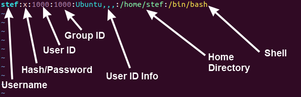
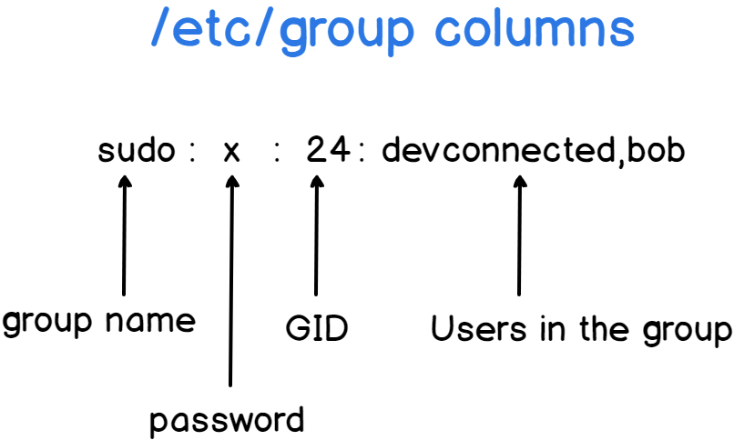

### Types of Users

- Root user account
  - mainly used for administrative tasks or to execute commands as root user (sudo)
  - has the highest privilege
- Regular user account
  - regular login user and many such user accounts can be created
- Service user account
  - these accounts are used by services (like mysql, postgres, jenkins) to run processes and execute functions

### Managing permissions

Permissions can be managed at two levels

- User level

  - giving permissions directly to the users
  - `cat /etc/passwd` lists all available users

    

- Group level

  - add users to the groups and provide permissions at group level
  - `cat /etc/groups` lists all available groups

    

### File permissions and Ownership

