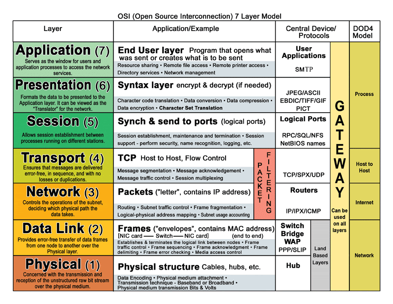

# Networking basic concepts

## OSI model

Image resource - https://sites.google.com/site/yutbms/osi-model

Image resource - https://community.fs.com/blog/tcpip-vs-osi-whats-the-difference-between-the-two-models.html

## Resources

[1] [Networking basics playlist](https://www.youtube.com/playlist?list=PLcnJIHtHiTA0C9UXgU2C6eTQMVFzSlIdP)

[2] [OSI model](https://www.youtube.com/watch?v=0Rb8AkTEASw&t=187s)

[3] [https://www.computernetworkingnotes.com/ccna-study-guide/osi-seven-layers-model-explained-with-examples.html]

[4] [https://www.inetdaemon.com/tutorials/basic_concepts/network_models/osi_model/real_world_example.shtml]
